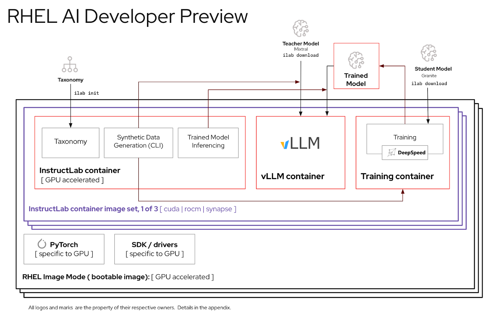
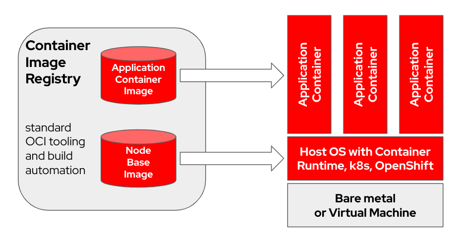
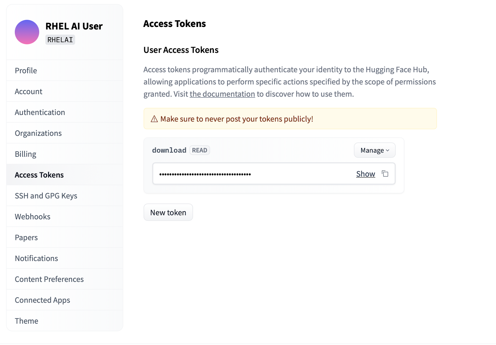
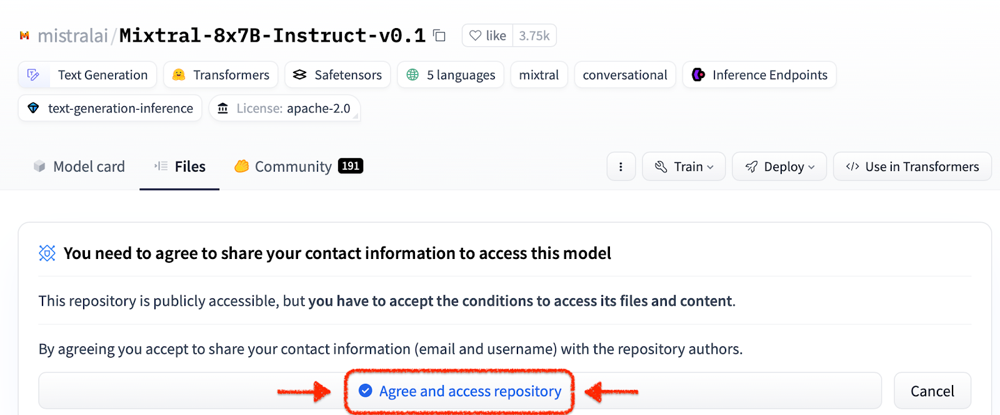

# RHEL AI Developer Preview Guide

This guide will help you assemble and test a [developer
preview](https://access.redhat.com/support/offerings/devpreview) version of the
RHEL AI product.

## Overview

Welcome to the **Red Hat Enterprise Linux AI Developer Preview!** This guide is
meant to introduce you to RHEL AI Developer Preview capabilities. As with other
Developer Previews, expect changes to these workflows, additional automation and
simplification, as well as a broadening of capabilities, hardware and software
support versions, performance improvements (and other optimizations) prior to
GA.

> [!NOTE]
> RHEL AI is targeted at server platforms and workstations with discrete GPUs.
> For laptops, please use upstream [InstructLab](https://github.com/instructlab).



## Validated Hardware for Developer Preview

Here is a list of servers validated by Red Hat engineers to work with the RHEL
AI Developer Preview. We anticipate that recent systems certified to run RHEL 9,
with recent datacenter GPUs such as those listed below, will work with this
Developer Preview.

- Minimum Total GPU memory: 320GB (e.g., 4 GPUs @ 80GB memory each)
- Minimum 200GB of disk space for model storage.

### Compute Vendor

| GPU Vendor / Specs   | RHEL AI Dev Preview |
|----------------------|---------------------|
| Dell (4) NVIDIA H100 | Yes                 |
| Lenovo (8) AMD MI300x| Yes                 |
| AWS p4 and p5 instances (NVIDIA) | Ongoing |
| IBM                  | Ongoing             |
| Intel                | Ongoing             |

### Training Performance - What to Expect

For the best experience using the RHEL AI developer preview period, we have
included a pruned taxonomy tree inside the InstructLab container. This will
allow for validating training to complete in a reasonable time frame on a single
server.

- Add your knowledge and skills to this version of the taxonomy. We recommend you add no more than 5 additions to the taxonomy tree to keep the resource requirements reasonable.
- On systems like the above, training should take ~1 hour.

**Formula:**
A single GPU can train ~250 samples per minute.
If you have 8 GPUs and 10,000 samples, expect it to take $`(10000/250/8*10)`$ minutes, or about 50 minutes for 10 epochs.
For smoke testing, feel free to run 1-2 epochs (note we recommend 10 epochs for best results).

## Trying it Out

By the end of this exercise, you’ll have:

- Built a set of Image-Mode and InstructLab containers
- Booted your system into the RHEL AI Image-Mode container
- Run through the InstructLab exercises to demonstrate the technology

### What is bootc?

[`bootc`](https://containers.github.io/bootc/) is a transactional, in-place
operating system that provisions and updates using OCI/Docker container images.
`bootc` is the key component in a broader mission of bootable containers.

The original Docker container model of using "layers" to model applications has
been extremely successful. This project aims to apply the same technique for
bootable host systems - using standard OCI/Docker containers as a transport and
delivery format for base operating system updates.

The container image includes a Linux kernel (in e.g. `/usr/lib/modules`), which is
used to boot. At runtime on a target system, the base userspace is not itself
running in a container by default. For example, assuming `systemd` is in use,
`systemd` acts as `pid1` as usual - there's no "outer" process.

In the following example, the bootc container is labeled `Node Base Image`:



## Build Host Prerequisites

Depending on your build host hardware and internet connection speed, building
and uploading container images could take up to 2 hours.

- RHEL 9.4
- Connection to the internet (some images are > 15GB)
- 4 CPU, 16GB RAM, 400GB disk space (tested with AWS EC2 `m5.xlarge` using GP3 storage)
- A place to push container images that you will build – e.g., `quay.io` or another image registry.

## Preparing the Build Host

Register the host ([How to register and subscribe a RHEL system to the Red Hat
Customer Portal using Red Hat
Subscription-Manager?](https://access.redhat.com/solutions/253273))

```sh
sudo subscription-manager register --username <username> --password <password>
```

Install required packages

```sh
sudo dnf install git make podman buildah lorax -y
```

Clone the RHEL AI Developer Preview git repo

```sh
git clone https://github.com/RedHatOfficial/rhelai-dev-preview
```

Authenticate to the Red Hat registry ([Red Hat Container Registry
Authentication](https://access.redhat.com/RegistryAuthentication)) using your
`redhat.com` account.

```shell
podman login registry.redhat.io --username <username> --password <password>
podman login --get-login registry.redhat.io
Your_login_here
```

Ensure you have an SSH key on the build host. This is used during the driver
toolkit image build. ([Using `ssh-keygen` and sharing for key-based authentication
in Linux | Enable Sysadmin](https://www.redhat.com/sysadmin/configure-ssh-keygen))

### Creating bootc containers

RHEL AI includes a set of Makefiles to facilitate creating the container images.
Depending on your build host hardware and internet connection speed, this could
take up to an hour.

Build the InstructLab NVIDIA container image.

```sh
make instruct-nvidia
```

Build the [`vllm`](https://github.com/vllm-project/vllm) container image.

```sh
make vllm
```

Build the [`deepspeed`](https://www.deepspeed.ai/) container image.

```sh
make deepspeed
```

Last, build the RHEL AI NVIDIA `bootc` container image. This is the RHEL
Image-mode “bootable” container. We embed the 3 images above into this
container.

```sh
make nvidia FROM=registry.redhat.io/rhel9/rhel-bootc:9.4
```

The resulting image is tagged `quay.io/rhelai-dev-preview/nvidia-bootc:latest`.
For more variables and examples, see the
[training/README](https://github.com/rhelai-dev-preview/tree/main/training).

Tag your image with your registry name and path:

```sh
podman tag quay.io/<your-user-name>/nvidia-bootc:latest quay.io/<your-user-name>/nvidia-bootc:latest
```

Push the resulting image to your registry. You will refer to this URL inside a
kickstart file in an upcoming step.

```sh
podman push quay.io/<your-user-name>/nvidia-bootc:latest
```

> At this point you have a RHEL AI bootable container image ready to be installed on a physical or virtual host.

### Provisioning your GPU host (kickstart method)

[Anaconda](https://docs.anaconda.com/free/anaconda/install/index.html) is the
Red Hat Enterprise Linux installer, and it is embedded in all RHEL downloadable
ISO images. The main method of automating RHEL installation is
via scripts called Kickstart. For more information about Anaconda and Kickstart,
[read these documents](https://access.redhat.com/documentation/en-us/red_hat_enterprise_linux/9/html-single/performing_an_advanced_rhel_9_installation/index#what-are-kickstart-installations_kickstart-installation-basics).

A recent kickstart command called
[`ostreecontainer`](https://pykickstart.readthedocs.io/en/latest/kickstart-docs.html#ostreecontainer)
was introduced with RHEL 9.4.  We use `ostreecontainer` to provision the bootable
`nvidia-bootc` container you just pushed to your registry over the network.

Here is an example of a kickstart file. Copy it to a file called
`rhelai-dev-preview-bootc.ks`, and customize it for your environment:

```text
# text
## customize this for your target system
# network --bootproto=dhcp --device=link --activate

## Basic partitioning
## customize this for your target system
# clearpart --all --initlabel --disklabel=gpt
# reqpart --add-boot
# part / --grow --fstype xfs

# ostreecontainer --url quay.io/<your-user-name>/nvidia-bootc:latest

# firewall --disabled
# services --enabled=sshd

## optionally add a user
# user --name=cloud-user --groups=wheel --plaintext --password
# sshkey --username cloud-user "ssh-ed25519 AAAAC3Nza....."

## if desired, inject an SSH key for root
# rootpw --iscrypted locked
# sshkey --username root "ssh-ed25519 AAAAC3Nza..."
# reboot
```

### Embed your kickstart into the RHEL Boot ISO

[Download the RHEL
9.4](https://developers.redhat.com/products/rhel/download#rhel-new-product-download-list-61451)
“Boot ISO”, and use `mkksiso` command to embed the kickstart into the RHEL
boot ISO.

```sh
mkksiso rhelai-dev-preview-bootc.ks rhel-9.4-x86_64-boot.iso rhelai-dev-preview-bootc-ks.iso
```

At this point you should have:

- `nvidia-bootc:latest`: a bootable container image with support for NVIDIA GPUs
- `rhelai-dev-preview-bootc.ks`: a kickstart file customized to provision RHEL from your container registry to your target system.
- `rhelai-dev-preview-bootc-ks.iso`: a bootable RHEL 9.4 ISO with the kickstart embedded.

Boot your target system using the `rhelai-dev-preview-bootc-ks.iso` file.
anaconda will pull the nvidia-bootc:latest image from your registry and
provision RHEL according to your kickstart file.

**Alternative**: the kickstart file can be served via HTTP. On the installation via kernel command line and an external HTTP server – add `inst.ks=http(s)://kickstart/url/rhelai-dev-preview-bootc.ks`

## Using RHEL AI and InstructLab

### Download Models

Before using the RHEL AI environment, you must download two models, each
tailored to a key function in the high-fidelity tuning process.
[Granite](https://huggingface.co/instructlab) is used as the student model and
is responsible for facilitating the training of a new
fine-tuned mode.
[Mixtral](https://huggingface.co/mistralai/Mixtral-8x7B-Instruct-v0.1) is used
as the teacher model and is responsible for aiding the generation phase of the
LAB process, where skills and knowledge are used in concert to produce a rich
training dataset.

### Prerequisites

- Before you can start the download process, you need to create an account on
  [HuggingFace.co](https://huggingface.co/) and manually acknowledge the terms and
  conditions for Mixtral.
- Additionally, you will need to create a token on the Hugging Face site so we
  can download the model from the command line.
  - Click on your profile in the upper right corner and click `Settings`.
  - Click `Access Tokens`. Click the `New token` button and provide a name. The
    new token only requires the use of `Read` permissions since it's only being
    used to fetch models. On this screen, you will be able to generate the token
    content and save and copy the text to authenticate.



- Review and accept the terms of the Mixtral model



#### Understanding the Differences Between ilab and RHEL AI CLIs

The `ilab` command line interface that is part of the InstructLab project focuses
on running lightweight quantized models on personal computing devices like
laptops. In contrast, RHEL AI enables the use of high-fidelity training using
full-precision models. For familiarity, the command and parameters mirror that
of InstructLab’s `ilab` command; however, the backing implementation is very
different.

> In RHEL AI, the `ilab` command is a **wrapper** that acts as a front-end to a container architecture pre-bundled on the RHEL AI system.

### Using the `ilab` Command Line Interface

### Create a working directory for your project

The first step is to create a new working directory for your project. Everything
will be relative to this working directory. It will contain your models, logs,
and training data.

```shell
mkdir my-project
cd my-project
```

#### Initialize your project

The very first `ilab` command you will run sets up the base environment, including
downloading the taxonomy repo if you choose. This will be needed for later
steps, so it is recommended to do so.

```sh
ilab init
```

#### Download Granite-7B (~27GB on disk)

Next, download the IBM Granite base model. Important: Do not download the “lab”
versions of the model. The granite **base** model is most effective when
performing high-fidelity training.

```sh
ilab download --repository ibm/granite-7b-base
```

#### Download Mixtral-8x7B-Instruct (~96GB on disk)

Follow the same process, but additionally define an environment variable using
the HF token you created in the above section under Access Tokens.

```shell
export HF_TOKEN=<paste token value here>
ilab download --repository mistralai/Mixtral-8x7B-Instruct-v0.1
```

#### Directory Structure

Now that you have initialized your project and downloaded your first models,
observe the directory structure of your project

```text
my-project/
├─ models/
├─ generated/
├─ taxonomy/
├─ training/
├─ training_output/
├─ cache/
```

| Folder | Purpose |
| --- | --- |
| models | Holds all language models, including the saved output of ones you generate with RHEL AI |
| generated | Generated data output from the generation phase, built on modifications to the taxonomy repository |
| taxonomy | Skill or Knowledge data used by the LAB method to generate synthetic data for training |
| training | Converted seed data to facilitate the training process |
| training_output | All transient output of the training process, including logs and in-flight sample checkpoints |
| cache | An internal cache used by the model data |

### Modifying the Taxonomy

The next step is to contribute new knowledge or skills into the taxonomy repo.
See the [InstructLab
documentation](https://github.com/instructlab/taxonomy/blob/main/README.md) for
more information and examples of how to do this. We also have a set of lab
exercises here.

#### Launching the Teacher model

With the additional taxonomy data added, it’s now possible to generate new
synthetic data to eventually train a new model. Although, before generation can
begin, a teacher model first needs to be started to assist the generator in
constructing new data. In a separate terminal session, run the “serve” command
and wait for the VLLM startup to complete. Note this process can take several
minutes to complete

```shell
ilab serve
INFO:     Application startup complete.
INFO:     Uvicorn running on http://0.0.0.0:8080 (Press CTRL+C to quit)
```

#### Generating new Synthetic Data

Now that VLLM is serving the teacher mode, the generation process can be started
using the `ilab` generate command. This process will take some time to complete
and will continually output the total number of instructions generated as it is
updated. This defaults to 5000 instructions, but you can adjust this with the
`--num-instructions` option.

```sh
ilab generate
```

```text
Q> How do cytokines influence the outcome of certain diseases involving tonsils?
A> The outcome of infectious, autoimmune, or malignant diseases affecting tonsils may be influenced by the overall balance of production profiles of pro-inflammatory and anti-inflammatory cytokines. Determining cytokine profiles in tonsil studies is essential for understanding the causes and underlying mechanisms of these disorders.
 35%|████████████████████████████████████████▉ 
```

#### Examining the Synthetic Data Set

In addition to the current data printed to the screen during generation, a full
output is recorded in the generated folder. Before training it is recommended to
review this output to verify it meets expectations. If it is not satisfactory,
try modifying or creating new examples in the taxonomy and rerunning.

```sh
less generated/generated_Mixtral*.json
```

#### Stopping VLLM

Once the generated data is satisfactory, the training process can begin.
Although first close the VLLM instance in the terminal session that was started
for generation.

```text
CTRL+C
INFO:     Application shutdown complete.
INFO:     Finished server process [1]
```

> You may receive a Python KeyboardInterrupt exception and stack trace. This can be safely ignored.

### Starting Training

With VLLM stopped and the new data generated, the training process can be
launched using the `ilab train` command. By default, the training process
saves a model checkpoint after every 4999 samples. You can adjust this using the
`--num-samples` parameter. Additionally, training defaults to running for 10
epochs, which can also be adjusted with the `--num-epochs` parameter. Generally,
more epochs are better, but after a certain point, more epochs will result in
overfitting. It is typically recommended to stay within 10 or fewer epochs and to
look at different sample points to find the best result.

```sh
ilab train --num-epochs 9
```

```text
RunningAvgSamplesPerSec=149.4829861942806, CurrSamplesPerSec=161.99957513920629, MemAllocated=22.45GB, MaxMemAllocated=29.08GB
throughput: 161.84935045724643 samples/s, lr: 1.3454545454545455e-05, loss: 0.840185821056366 cuda_mem_allocated: 22.45188570022583 GB cuda_malloc_retries: 0 num_loss_counted_tokens: 8061.0 batch_size: 96.0 total loss: 0.8581467866897583
Epoch 1: 100%|█████████████████████████████████████████████████████████| 84/84 [01:09<00:00,  1.20it/s]
 total length: 2527 num samples 15 - rank: 6 max len: 187 min len: 149
```

#### Serving the New Model

Once the training process has completed, the new model entries will be stored in
the models directory with locations printed to the terminal

```text
Generated model in /root/workspace/models/tuned-0504-0051:
.
./samples_4992
./samples_9984
./samples_14976
./samples_19968
./samples_24960
./samples_29952
./samples_34944
./samples_39936
./samples_44928
./samples_49920
```

The same `ilab serve` command can be used to serve the new model by passing the
–model option with the name and sample

```sh
ilab serve --model tuned-0504-0051/samples_49920
```

#### Chatting with the New Model

After VLLM has started with the new model, a chat session can be launched by
creating a new terminal session and passing the same `--model` parameter to chat
(Note that if this does not match, you will receive a 404 error message).  Ask
it a question related to your taxonomy contributions.

```sh
ilab chat --model tuned-0504-0051/samples_49920
```

#### Example Chat Session with the New Model

```shell
╭─────────────────────────────── system ────────────────────────────────╮
│ Welcome to InstructLab Chat w/                                        │
│ /INSTRUCTLAB/MODELS/TUNED-0504-0051/SAMPLES_49920 (type /h for help)  │
╰───────────────────────────────────────────────────────────────────────╯

>>> What are tonsils?
╭────────── /instructlab/models/tuned-0504-0051/samples_49920 ──────────╮
│                                                                       │
│ Tonsils are a type of mucosal lymphatic tissue found in the           │
│ aerodigestive tracts of various mammals, including humans. In the     │
│ human body, the tonsils play a crucial role in protecting the body    │
│ from infections, particularly those caused by bacteria and viruses.   │
╰─────────────────────────────────────────────── elapsed 0.469 seconds ─╯
```

> To exit the session, type `exit`

### Summary

That’s it! The purpose of a Developer Preview is to get something out to our
users for early feedback. We realize there may be bugs. And we appreciate your
time and effort if you’ve made it this far. Chances are you hit some issues or
needed to troubleshoot. We encourage you to file bug reports, feature requests,
and ask us questions. See the contact information below for how to do that.
Thank you!

### How to contact us

- To report bugs or request features, use the GitHub issues page.
- For questions: send us an email <help-rhelai-devpreview@redhat.com>
- For InstructLab: please see the community documentation.

### Known Issues

- We have not tried this with Fedora (coming soon!)
- We intend to include a toolbox container inside the bootc container. For now, you can pull any toolbox image (e.g., Fedora Toolbx).
- RHUI-entitled hosts (e.g., on AWS) will require additional configuration to move from RHUI cloud auto-registration to Red Hat standard registration.
- Use subscription-manager with username/password or activation key, then run the following command: `$ sudo subscription-manager config --rhsm.manage_repos=1`

### Troubleshooting

- `nvidia-smi` to make sure the drivers work and can see the GPUs
- `nvtop` (available in EPEL) to see whether the GPUs are being used (some code paths have CPU fallback, which we don’t want here)
- “no space left on device” errors (or similar) during container builds
Ensure your build host has 400GB of storage.
- Run `make prune` out of the training subdirectory. This will clean up old build artifacts.
- Sometimes, interrupting the container build process may lead to wanting a complete restart of the process. For those cases, we can instruct Podman to start from scratch and discard the cached layers. This is possible by passing the `--no-cache` parameter to the build process

```sh
make nvidia-bootc CONTAINER_TOOL_EXTRA_ARGS="--no-cache"
```

- The building of accelerated images requires a lot of temporary disk space. In case you need to specify a directory for temporary storage, this can be done with the `TMPDIR` environment variable:

```sh
make <platform> TMPDIR=/path/to/tmp
```
